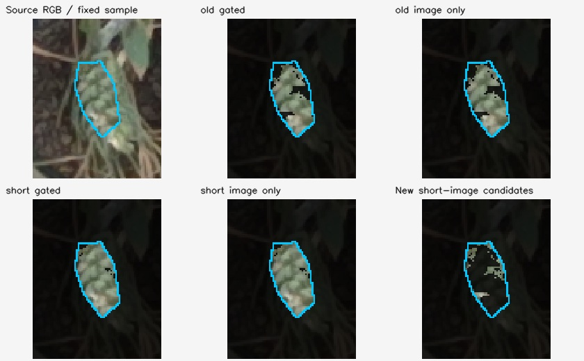
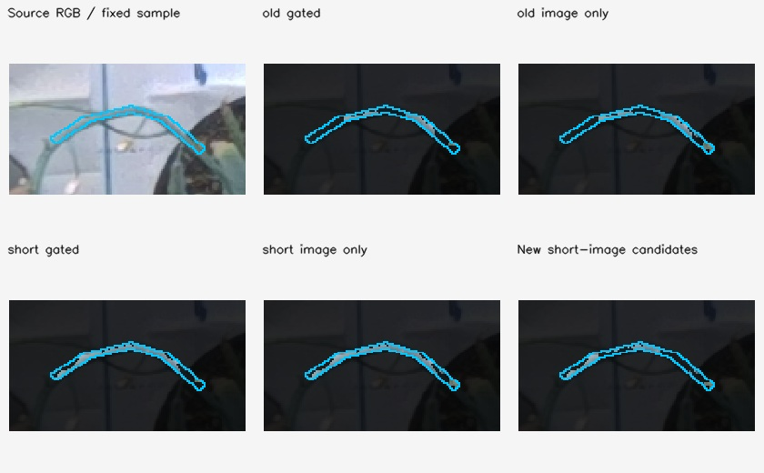

# Independent comparison on frozen source-image samples

Date: 7 October 2026. **59/59 integrity and raster checks passed.** Comparison covers five exact anchors: 275384, 487431, 799028, 1055904 and 1420709. Twenty annotations were fixed from source RGB before old/new coverage review: fifteen plant-surface samples and five bare-board controls. They are assistant-reviewed, with operator confirmation pending, and are not complete-plant masks or metric ground truth.

## Outcome

Shorter baselines and image-only ROI provide promising **local candidate coverage gains**, but are not uniformly better. On the 8,444 fixed plant-sample pixels, candidate coverage changes from **84.66%** (original pairs, sensor ROI) to **87.22%** (original pairs, image ROI), **87.73%** (shorter pairs, sensor ROI), and **90.94%** (shorter pairs, image ROI). Large already-complete leaf patches dominate this pooled percentage; it is not a specimen-averaged score or a plant completeness/accuracy claim.

Useful local examples are the P1 ear sample, **78.4% → 96.9%**, P2 exposed upper stem, **37.7% → 96.2%**, P4 arch, **34.2% → 68.4%**, and P4 upright stalk, **41.0% → 80.1%**, comparing original gated with short image-only candidates. Their depth distributions provide evidence beyond a larger full-scene point count. P1 dry-strip coverage does **not** improve from shorter pairs alone: original image-only is 69.4%, short image-only 68.2%. P1 green attachment remains mostly unsupported. Broad leaf controls already at 100% retain that coverage.

The three conditionally triangulated P4 landmarks reveal a counterexample: **the hanging bud is better supported by the original pair set with the image ROI than by the shorter set**. A blanket replacement of the original neighbors would discard useful evidence. Preserve both alternatives for a controlled multi-anchor test.

## Same fixed raster and evidence

The annotation masks are defined in native distorted RGB. This audit remaps each individual mask and its frozen label raster using the same `initUndistortRectifyMap` as reconstruction (factory K/dist, unchanged K, 1280×720), nearest-neighbor labels and a zero-valued border. Primary counts include only class 1 plant-sample or class 3 bare-board pixels, intersected with the valid image footprint. Class 2 localization bands are excluded; their coverage and depth sensitivity are recorded separately in the JSON. Thin centerline samples are preserved as drawn, without erosion, expansion or retuning.

The source-image digest matches each frozen view. Fresh undistorted source colours exactly match both original and probe RGB arrays. The four candidate masks were independently reproduced from saved depth, votes, image footprint and sensor ROI, then checked against probe copies. Probe-file hashes and frozen profile/bundle/annotation digests match, and all read inputs remain unchanged at completion. No new reconstruction, gate relaxation, manual-dimension fit or annotation edit occurred.

The four variants hold the factory camera, bundle poses, near/far interval and pair-consensus thresholds fixed. `old_gated` reproduces the original sensor-dependent mask. `old_image_only` changes only the ROI. `short_gated` changes the selected neighbor set but retains sensor ROI. `short_image_only` combines the nearest-neighbor pair selection with the image footprint. These are repeated-stereo candidates, not fused surfaces passing multi-anchor visibility.

## Per-annotation primary coverage counts

`N` is the fixed remapped sample size. OG = original gated, OI = original image-only, SG = short gated, SI = short image-only. Last column is the median candidate Z for OI → SI, in conditional metres. Full quantiles, fixed 50 mm histograms, uncertainty-band statistics and additions/losses are preserved for all four variants in `probe_comparison.json`.

| Plant sample | N | OG | OI | SG | SI | Median Z: OI → SI, m |
| --- | ---: | ---: | ---: | ---: | ---: | --- |
| P1_ear_body | 704 | 552 | 552 | 682 | 682 | 0.2783 → 0.2784 |
| P1_dry_hanging_strip | 242 | 130 | 168 | 126 | 165 | 0.6142 → 0.6137 |
| P1_green_peduncle_region | 238 | 0 | 0 | 0 | 7 | - → 0.3282 |
| P2_upper_curved_stem | 239 | 90 | 189 | 100 | 230 | 0.2176 → 0.2167 |
| P2_upright_narrow_leaf | 291 | 291 | 291 | 291 | 291 | 0.2820 → 0.2819 |
| P2_lower_textured_leaf | 589 | 589 | 589 | 589 | 589 | 0.2420 → 0.2421 |
| P3_lower_main_stem | 322 | 79 | 108 | 79 | 118 | 0.3094 → 0.3098 |
| P3_upper_leaf_interior | 1246 | 1246 | 1246 | 1246 | 1246 | 0.4489 → 0.4488 |
| P3_left_leaf_interior | 587 | 587 | 587 | 587 | 587 | 0.5156 → 0.5157 |
| P4_upper_arch | 275 | 94 | 116 | 171 | 188 | 0.2604 → 0.2545 |
| P4_upright_flower_stalk | 156 | 64 | 81 | 105 | 125 | 0.2489 → 0.2500 |
| P4_yellow_flower | 268 | 141 | 152 | 146 | 165 | 0.2034 → 0.2035 |
| P5_green_leaf_control | 1193 | 1193 | 1193 | 1193 | 1193 | 0.5177 → 0.5169 |
| P5_visible_upper_stem | 168 | 167 | 167 | 167 | 167 | 0.6263 → 0.6264 |
| P5_brown_leaf_control | 1926 | 1926 | 1926 | 1926 | 1926 | 0.5406 → 0.5409 |

Each panel keeps the original source colour where the indicated variant supports the fixed sample. The cyan outline sits outside the sample so it does not conceal the measured pixels of thin stems. The last panel shows pixels newly supported by SI relative to OG, not validated new plant geometry. Source colours attached to a depth estimate do not establish that the depth belongs to that visible foreground surface.

## Depth evidence and remaining risks

- **P1 ear:** OI depth P10/median/P90 is 0.2641/0.2783/0.2893 m; SI is 0.2647/0.2784/0.2908 m. Coverage rises without a large distribution shift. The repeated-grain landmark was excluded by the source-review agent, so this remains descriptive evidence, not independent organ-depth validation.
- **P2 upper stem:** the increase retains a compact near-surface distribution (SI P10/median/P90 0.2139/0.2167/0.2183 m). Much of the gain is attributable to removing the sensor ROI, with an additional short-pair gain.
- **P3 lower stem:** OI P90 is 0.3224 m but SI P90 reaches **0.5222 m** while the median stays near 0.31 m. Extra coverage therefore includes a farther-depth tail that must be reviewed. It cannot all be counted as confirmed stem recovery.
- **P4 arch:** OI P90 reaches 0.7101 m, while SI P90 is 0.2618 m with median 0.2545 m. The smaller far-depth tail plus greater fixed-sample coverage is encouraging, but does not replace correspondence and multi-view surface checks.
- **P4 stalk/flower:** distributions remain centered near 0.25/0.20 m. The landmark comparison below still exposes local failures and measurement ambiguity.

Bare-board samples are kept separate. Their occupancy is legitimate in a full-scene reconstruction and is **not** a false-positive rate. On 2,012 fixed board pixels, candidate coverage is OG 61.53%, OI 76.84%, SG 66.65%, SI 80.82%. A larger scene cloud therefore also contains more background.

| Bare-board control | N | OG | OI | SG | SI | Median Z: OI → SI, m |
| --- | ---: | ---: | ---: | ---: | ---: | --- |
| P1 board | 399 | 398 | 398 | 399 | 399 | 0.8727 → 0.8731 |
| P2 board | 361 | 63 | 63 | 87 | 87 | 0.4521 → 0.4516 |
| P3 board | 373 | 294 | 332 | 283 | 319 | 0.8701 → 0.8714 |
| P4 board | 238 | 116 | 116 | 202 | 202 | 0.8752 → 0.8728 |
| P5 board | 641 | 367 | 637 | 370 | 619 | 0.8743 → 0.8746 |

Most board controls lie around 0.87 m. The P2 bare-board control is **bimodal**, with a near branch around 0.45 m as well as a far branch near 0.88 m in both pair choices. That is an unresolved depth-consistency warning, not evidence that its increased occupancy is an improvement. A plant pixel with a depth matching the board behind it likewise is not counted here as verified recovery. Similar depth alone cannot always distinguish a real low-lying plant surface from background, and these source masks supply no independent metric depth truth.

## Conditional P4 landmark check

Only the three tracks explicitly accepted by `conditional_landmark_depth_review.json` are evaluated, at the exact 1055904 probe. The P1 repeated-grain track, P4 leaf tip and partially occluded junction remain excluded. These landmarks were selected from source views before reconstruction comparison. They still share the same factory camera, bundle poses and conditional scale; their intervals include only annotation-pixel perturbation, excluding pose, calibration, scale and material-point-identity systematic errors.

For each landmark, its native ±3-pixel box was remapped with nearest-neighbor labels. Each cell below is **candidate pixels inside the conditional depth interval / all candidate pixels in that patch**. Nearby pixels may lie on another part or background, so this is conditional local corroboration, not a universal pass/fail accuracy metric.

| Accepted landmark | Conditional Z interval, m | OG | OI | SG | SI |
| --- | --- | ---: | ---: | ---: | ---: |
| P4_single_hanging_bud | 0.1891–0.1994 | 10/10 | 28/28 | 4/5 | 9/18 |
| P4_left_yellow_flower_junction | 0.2002–0.2115 | 6/49 | 6/49 | 7/49 | 7/49 |
| P4_right_yellow_flower_junction | 0.2438–0.2614 | 49/49 | 49/49 | 49/49 | 49/49 |

The hanging bud's original image-only centre estimate is **0.194122 m**, close to the conditional triangulated 0.194179 m; the short-pair centre is absent. OI has 28/28 patch candidates inside the interval, while SI has only 9/18. This is a meaningful local regression despite overall coverage gains.

The right flower junction has 49/49 in-interval patch candidates for every variant and essentially unchanged centre estimates. The left flower junction has centre depths around **0.19991 m**, roughly 5.9 mm below the conditional reference 0.205795 m, with most patch pixels just below the interval. Both pair sets share this discrepancy. It may reflect localization/surface variation or shared reconstruction/model error; the pixel-only interval is not a complete uncertainty budget and the comparison does not establish absolute millimetre accuracy.

## Interpretation and next comparison

The evidence supports testing the image-domain ROI and retaining complementary near and original baselines. It does not support choosing a method from coverage alone, treating every additional point as plant, or claiming the first four plants are now complete. A later combined method must keep independent-anchor support/conflict checks and report whether the gains survive without transferring board depths into missing stems. Include the hanging-bud regression, P3 far-depth tail, P2 board inconsistency and still-missing green attachment in that review.

The JSON records counts, depth distributions, source hashes, exact per-annotation transitions, mask uncertainty sensitivity and conditional landmark results. `probe_comparison.py` reproduces the analysis and twenty source-colour overlays without changing the frozen annotations or either reconstruction output.
