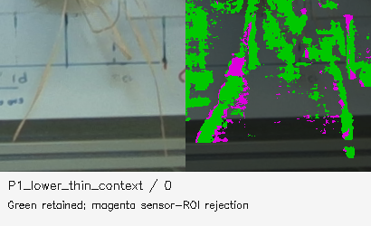
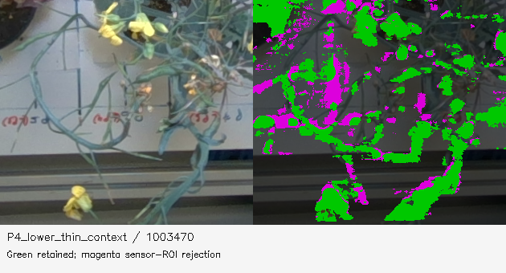

# Where existing reconstruction candidates are lost

Audit date: 7 October 2026. Scope: the 32 saved stereo anchors and 192 existing image pairs from `scene_rgb_v1`, plus recorded fusion-stage counts in `scene_supported_replay_v2`. **No application code, reconstruction gate, raw input or manual trait value was changed or used for tuning.** This is a measurement of the current pipeline, not a new reconstruction or an accuracy claim.

## Main finding

The sensor-ROI hypothesis is confirmed. **491,839 of 4,995,895 existing repeated-stereo candidates (9.845%) are excluded solely because the sensor depth is outside the allowed ROI.** Of those exclusions, 444,482 coincide with zero sensor depth and 47,357 with sensor depth at or above 1.00 m. None is caused by a positive sensor depth at or below 0.15 m. There are 200,293 excluded candidates with at least three agreeing pair estimates.

These are **pixel-view observations**. The same surface can be counted in several anchors; whole-scene statistics also include support, pots and rig. Passing the existing stereo-consensus gate is evidence to investigate, not proof of correct plant geometry. The pairs share an anchor and can share systematic matching errors. The counts cannot be added to the final cloud as unique recovered points.

## Exact code path

- `processing/rgb_recovery/helpers.py:65–68` forms `valid` from sensor Z in `(near, far)` and copies it to `roi`. With `foreground='depth'`, neither the `auto` nor `colour` branches changes it.
- `processing/rgb_recovery/stereo.py:87–90` computes a depth median and votes across pair depths, then intersects `votes >= 2` and the stereo range test with that sensor-derived ROI.
- `processing/rgb_recovery/fusion.py:110–115` dilates the accepted mask by 51×51 for TSDF integration. This can include nearby unmasked stereo depth as free-space/background evidence.
- `processing/rgb_recovery/fusion.py:49–59`, especially line 55, requires the original mask for supporting visibility votes within the sampled one-pixel cross. Dilation alone therefore does not provide independent support through a broadly missing sensor region. Other anchors can still provide support; the measured anchor loss is not a one-to-one prediction of fused loss.

All 32 saved vote maps and depth-consensus maps were recomputed from the saved six-pair stacks, and **every value matched**. Every saved mask exactly matched the stated sensor-ROI rule. The saved sensor arrays also matched a fresh nearest-neighbor remap of the original depth PNG under the frozen intrinsics and 10000-units-per-metre setting. Recorded processing-module hashes remain unchanged. This isolates the additional ROI exclusion from stereo disagreement.

## Depth dependence

Depth here means the candidate RGB-stereo optical Z, with the existing conditional metric scale. Intervals are lower-inclusive/upper-exclusive, inside the strict original near/far gates.

| Stereo Z interval, m | Repeated candidates | Rejected solely by sensor ROI | Rejected fraction |
| --- | ---: | ---: | ---: |
| 0.15–0.25 | 236,403 | 28,180 | 11.92% |
| 0.25–0.35 | 126,538 | 17,634 | 13.94% |
| 0.35–0.50 | 527,175 | 34,919 | 6.62% |
| 0.50–0.70 | 1,400,971 | 93,558 | 6.68% |
| 0.70–1.00 | 2,704,808 | 317,548 | 11.74% |

## Representative visible thin structures

The boxes below were selected from saved undistorted RGB imagery and are recorded explicitly in the JSON. **They are context regions, not exclusive plant or organ segmentations.** The P1 lower box contains narrow visible structures over the board; the P4 boxes contain the yellow-flowering branching plant, plus background and potentially overlapping neighbors. No manual dimension or trait annotation defined these boxes.

| Context | Anchor | Repeated candidates | ROI-only exclusions | Fraction |
| --- | ---: | ---: | ---: | ---: |
| P1_context | 0 | 51,496 | 2,326 | 4.52% |
| P1_lower_thin_context | 0 | 11,643 | 1,563 | 13.42% |
| P4_context | 1003470 | 56,278 | 13,990 | 24.86% |
| P4_lower_thin_context | 1003470 | 25,175 | 6,584 | 26.15% |

Green pixels passed the existing mask. Magenta pixels already pass stereo repetition/range but were excluded by sensor ROI. Dark areas are not recovered simply by removing that ROI: they lack an accepted repeated candidate in these saved outputs. Some magenta coincides with visible thin plant structures, while other magenta belongs to background/edges; both need review. The original/context overlays and boxes are saved for that purpose.

## Baselines, search range and image borders

Actual bundled pair baselines range from **24.2 to 167.3 mm**, median **77.7 mm**. Neighbor selection at `processing/rgb_recovery/dataset.py:206–225` targets a disparity near 55 pixels at one estimated scene depth, not a separate overlap/visibility optimum for each height or thin organ.

At `processing/rgb_recovery/stereo.py:39`, the near bound sets the disparity search, rounded to 16 and capped at 640 pixels. Existing searches span **144–640 disparities**, median **384**. Only **2 of 192** pairs hit the cap. Their approximate closest searchable rectified Z reaches 0.176 m; the other pair limits are lower. Thus the hard cap can exclude some very near geometry, but is **not a universal explanation** for all four broken-looking plants.

There is a broader overlap cost. In the installed OpenCV 4.10 SGBM implementation, searched columns run from `max(minD + numD, 0)` to `width + min(minD, 0)`. For either disparity direction used here, the width is `image_width - numDisparities`. Existing pairs therefore search **50–88.75% of rectified image width**, median **70%**, before texture, occlusion, consistency and range rejections. [Versioned OpenCV source](https://github.com/opencv/opencv/blob/4.10.0/modules/calib3d/src/stereosgbm.cpp#L1518-L1520).

This is a source-derived search-window diagnostic, not the fraction of each plant lost. Remapping and other pairs can provide different coverage. The JSON retains `getValidDisparityROI` as a separate API diagnostic, but its negative-disparity result must not replace the actual signed-search-column formula. Shorter baselines can reduce occlusion and search-border loss, with a corresponding triangulation precision trade-off that requires evaluation.

The saved pair stacks contain outputs after SGBM uniqueness/speckle filtering, left-right consistency (`<0.8 px`), range tests and rectification. They do not preserve each rejected intermediate disparity. Consequently this audit **cannot separate** missing texture, speckle rejection, occlusion, search-border exclusion and left-right disagreement for every absent pixel. A controlled pair rerun is needed for that attribution.

## Later stage counts

| Stage | Existing count |
| --- | ---: |
| Extracted TSDF vertices before visibility | 6,202,311 |
| Retained by independent-view/conflict gates | 3,581,386 |
| Visibility rejection | 2,620,925 (42.26%) |
| Statistical rejection | 113,228 (3.16% of supported vertices) |
| Final statistical derivative; no DBSCAN | 3,468,158 |

These are unique TSDF vertices and use a different counting unit from the stereo tables. Rejections can be correct noise/background exclusions; lower rejection is not automatically better. The current files do not preserve pre-visibility evidence, so low support versus excessive conflict cannot be separated retrospectively. All statistical rejections remain recoverable through the supported checkpoint and retained/rejected index mapping.

## What a controlled next experiment can establish

1. Hold camera poses, saved stereo depths, two-pair agreement, near/far bounds and three-view/conflict fusion gates fixed. Compare the existing sensor ROI with an independently defined RGB/scene ROI on the same measured candidates. Preserve additions and show whether they remain consistent across independent anchors. Do not identify all extra points as plant.
2. Compare selected shorter-baseline pairs at representative P1/P4 views with the same matching/consistency thresholds. Report common-view coverage, left-right residuals, anchor-to-anchor reprojection and failures at thin structures. Prefer fixed criteria over tuning against manual lengths or heights.
3. Preserve per-stage masks, unfiltered supported points and exclusion reasons. Evaluate background leakage and geometric contradiction alongside coverage. Keep manual traits held out until processing and specimen/organ correspondence are frozen.

The current result is therefore **not established as the best obtainable from these data**. There is a concrete avoidable coupling to investigate, especially around the P4 thin region. The audit does not promise recovery of unseen leaf undersides, reliably measured geometry where all pairs failed, or a perfect gap-free plant.

## Reproduction

`audit_saved_stereo.py` recreates the numeric audit and diagnostic overlays from frozen saved stereo caches, bundle poses and raw depth PNGs. It runs one anchor at a time, performs no SGBM/ICP/TSDF rerun, and writes only this generated audit folder. `stage_loss_audit.json` records frame/pair/region detail, NPZ hashes, exact source references, source-profile/bundle hashes and interpretation limits.
