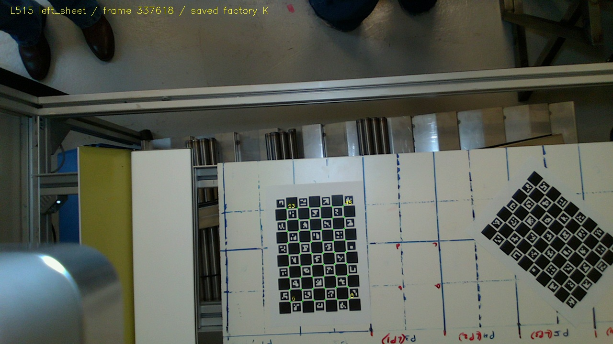
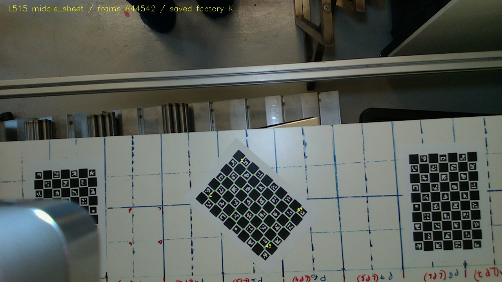
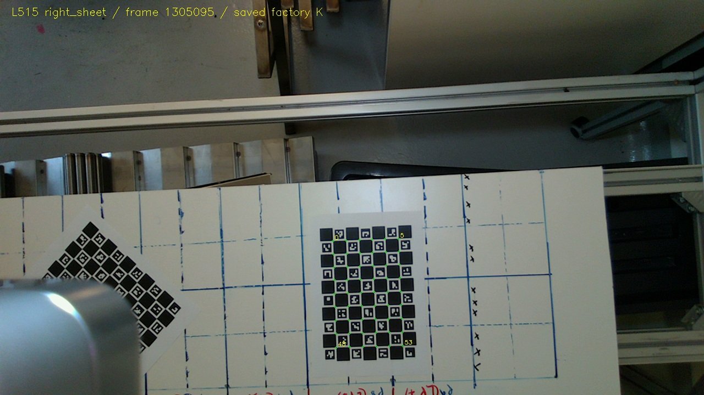

# L515 checkerboard calibration and transfer

Separate L515 initialization is available in `calibration_transfer.json`. It uses the saved colour camera model, three separately tracked checkerboard sheets, and gantry-conditioned metric motion. The physical checker-square pitch and recording-time depth-unit setting are unverified; physical accuracy remains provisional.

## Actionable reconstruction settings

- Colour raster: 1280 by 720; K and distortion are preserved exactly from `kdc_intrinsics.txt`.
- Candidate depth unit: **0.00025000 m/count**, equivalent to a divisor of **4000 counts/metre**. This is the L515 candidate, derived independently from its own capture; no D405 scale is copied.
- Positive camera travel in camera axes: `[0.9979202861572708, -0.049944424084064125, -0.04075115923138635]`.
- Table-up direction: `[-0.03619329792889247, -0.05632471940180952, -0.9977562684189651]`.
- Plant reference ID: `0`. Initialize `T[:3,3] = direction * (frame_id-reference_id)/1e6`, with identity rotation. This maps frame camera coordinates into the reference camera; the sign reverses the observed board motion.
- Apply `upright_export_R_reference_camera_to_xyz_z_up` to the reference-frame cloud for upright export. Its origin stays at the reference camera; no soil or table height zero is invented.

## Board observations and pose quality

61 accepted sheet observations across 40 sampled frames. The model is 7 by 10 ChArUco squares, 54 inner intersections, compatible with DICT_4X4_50. Physical sheets repeat IDs and are never merged by ID. Marker diagonal intersections seed each sheet homography; the constructor marker ratio0.6 does not enter the square geometry or centre coordinates. True intersections are refined at native resolution.

The fixed-camera all-corner RMS is **0.1360 pixels**; held-out-corner RMS is **0.1562 pixels**. For each observation, each of three fits uses two corner-ID classes and evaluates the remaining class. These checks remain conditional on the permissive factory-model observation selection and are not external calibration accuracy. The board normals vary little out of plane, so no unconstrained intrinsic recalibration was performed.

| Sheet | Views | Assumed travel span (m) | Conditional pitch (mm) | Path RMS (mm) | Alternating-fit direction difference (deg) |
| --- | ---: | ---: | ---: | ---: | ---: |
| left_sheet | 18 | 0.719 | 24.308 | 1.414 | 0.1095 |
| middle_sheet | 22 | 0.882 | 24.281 | 1.225 | 0.0029 |
| right_sheet | 21 | 0.837 | 24.266 | 1.043 | 0.0769 |

The maximum disagreement between independently fitted sheet travel directions is 0.1253 degrees. The observed board-plane normal disagreements and within-sheet scatter include paper shape, pose noise and camera-model effects; they are not calibrated angular uncertainty. Gantry travel is 0.4214 degrees out of the fitted mean table plane, so the camera-motion vector is retained rather than forced into that plane.

## Depth units and actual board precision

Board motion in square coordinates versus filename travel estimates each sheet pitch without sensor depth or plant traits. Board pose predicts axial Z for every sampled interior colour ray; dividing predicted Z by aligned raw depth gives a per-frame estimate. The median across61 board frames is **0.000246124 m/count**. The observed frame-median range is 0.000244926 to 0.000247363 m/count.

This supports the0.00025 candidate and contradicts interpreting these counts as1mm or D4050.1mm. The approximately1.57% discrepancy is retained, not silently corrected. At this narrow range, constant axial bias, multiplicative scale error, gantry scale, board shape and camera-model error are confounded. The sensor pipeline must retain that uncertainty; a matched board plane is not permission to rescale the plant until it agrees.

| Sheet | Median valid fraction | Median raw depth | Median native-candidate Z (m) | Median all-valid plane MAD (mm) | Median all-valid plane RMS (mm) |
| --- | ---: | ---: | ---: | ---: | ---: |
| left_sheet | 1.00000 | 3712.0 | 0.9280 | 1.489 | 3.174 |
| middle_sheet | 1.00000 | 3704.5 | 0.9261 | 1.654 | 3.589 |
| right_sheet | 1.00000 | 3693.0 | 0.9233 | 1.615 | 3.104 |

Depth polygons are inset from the board edge, eroded two further pixels, and sampled on a2by2 lattice. Five SVD/three-MAD plane-trimming iterations estimate a robust plane. Reported residuals include all valid sampled interior pixels, including fit outliers. They measure planarity/precision and may include paper warp and alignment effects; they do not establish absolute depth accuracy. Full per-view counts, residual distributions and normal disagreements are retained in `depth_unit_diagnostics.json`.

The median valid fraction does not imply every board view is complete: the minimum valid interior fractions are35.7%,29.5% and63.6% for the left, middle and right sheets. The separate sensor audit investigates the persistent image swath and edge holes. The maximum per-view plane RMS is about10.4mm; the table reports medians, not worst-case precision.

The official librealsense L500 implementation obtains DEPTH_UNITS from device calibration (`read_znorm`, inverse calibration znorm converted from millimetres). It does not establish a universal hardcoded0.00025m default. Here0.00025 is a recording-specific candidate supported by the conditional board-motion check, not a verified saved device setting. Source: [librealsense L500 depth implementation](https://raw.githubusercontent.com/IntelRealSense/librealsense/v2.54.2/src/l500/l500-depth.cpp).

## Provenance and boundaries

Calibration has 1290 exact RGB/depth filename pairs; plant has 1278. Factory colour files match byte-for-byte between both runs. Native depth intrinsics describe1024by768, while inspected exported depth files are1280by720; use the colour model only under the colour-aligned export interpretation, supported by the matching exporter and separate alignment audit.

The matching exporter reads joint position (`rospy_thread_fin_1.py:140–142`), names images with `int(position*10**6)` (`:129–134`), and aligns depth to colour (`:112–123`,`:193`). It reads `get_depth_scale()` at line52 but does not persist that value. The file currently selects D405 streams, so its presence is format/procedure evidence, not proof of the exact L515 session build or settings. Filenames are likely position keys; describing them as established timestamps would be incorrect.

The physical square dimension is unavailable. No25mm or127/76mm target measurement is assumed. Conditional derived pitches are not measured board dimensions. Later measure several adjacent squares and verify actual print scaling, device depth units and gantry units. No manual plant dimensions, cross-camera transform or hyperspectral registration are used or established here.

Calibration parameters and coordinate conventions are in `calibration_transfer.json`; observations and rejected crops are in `corner_observations.json`. Run `calibrate_l515.py` then `finish_calibration_review.py` with the existing NumPy/OpenCV environment to reproduce these generated diagnostics. Raw recordings and application files are never written.

## Representative checked corners

